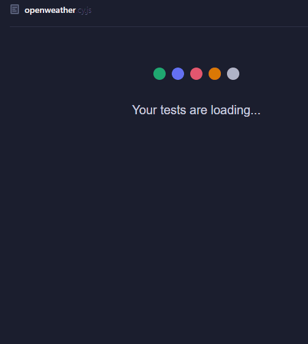
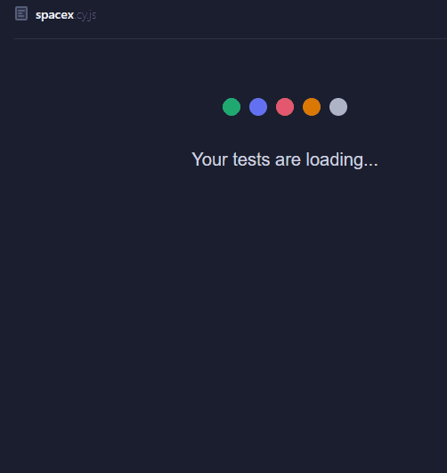

# API Test Automation

Este repositório está em construção e tem como objetivo a criação de testes automatizados exclusivos para APIs. Atualmente, estão incluídos testes para as APIs do OpenWeather e SpaceX, cobrindo funcionalidades essenciais como previsão do tempo e informações sobre lançamentos espaciais.

## Estrutura de Testes

### 1. **OpenWeather API Tests**


O teste da API OpenWeather foca na verificação das previsões de clima e dos dados climáticos para uma cidade específica. A estrutura do teste segue os principais cenários de requisições GET para dados de clima atual e previsões.

Arquivo: `openweather.cy.js`

#### Funcionalidades testadas:
- **Clima atual e Previsão do Tempo**: Verifica as condições climáticas atuais para uma cidade.
- **Nível e situação de poluição do ar**: Verifica e informa os dados e condições de poluição do ar.
- **Índice de raios UV**: Verifica o índice de raios Ultravioleta.

#### Algumas adaptações que fiz no projeto:
 - **Conversão de temperatura**: A API retorna em Kelvin, então rola uma conversão para Celsius.
 - **Velocidade do vento**: Converti de m/s para km/h para facilitar a leitura.
 - **Direção do vento**: Usei um algoritmo para traduzir os ângulos da API em direções cardeais (N, NE, S, etc.).



### 2. **SpaceX API Tests**


O teste da API SpaceX foca na verificação das informações sobre os lançamentos da SpaceX, bem como a lista de astronautas envolvidos. Este conjunto de testes inclui as requisições GET para os dados mais recentes de lançamentos e a lista de astronautas.

Arquivo: `spacex.cy.js`

#### Funcionalidades testadas:
- **Último lançamento**: Verifica os detalhes do último lançamento da SpaceX.
- **Próximos lançamentos**: Verifica os próximos lançamentos planejados pela SpaceX.
- **Astronautas**: Verifica a lista de astronautas que trabalharam com a SpaceX.



## Ferramentas Usadas

- **Cypress**: Framework para testes de automação de APIs e UI.
- **Chai**: Biblioteca para asserções nos testes.
- **Cypress.env**: Variáveis de ambiente configuradas para facilitar a troca de URLs e dados sensíveis.

## Metodologia de Testes

Os testes seguem uma abordagem de **testes funcionais** para garantir que as APIs da estejam respondendo conforme o esperado. A metodologia utilizada é a de **Testes Automatizados**, com foco em **verificação de status de resposta** (código 200) e **validação de conteúdo** (propriedades e tipos de dados retornados).

 `Outros testes com diferentes requisições de API serão desenvolvidas em breve (POST, PUT, PATH, DELETE)`

### Como rodar os testes:

1. Clone o repositório para sua máquina local:
   ```bash
   git clone https://github.com/seu-usuario/api-test-automation.git
   ```

2. Instale as dependências:
   ```bash
   npm install
   ```


3. Execute os testes no Cypress:
   ```bash
   npx cypress run
   ```
   ou 
   ```
   npm test
   ```